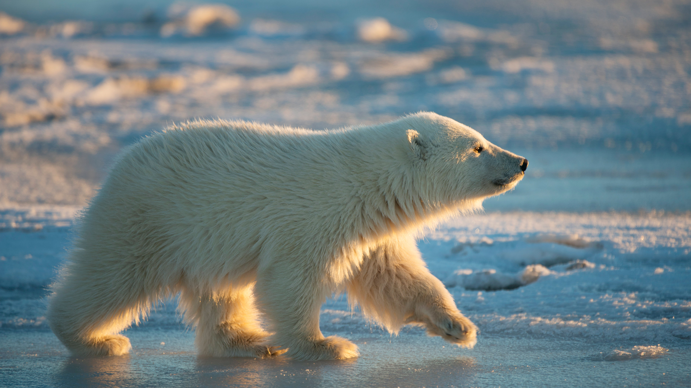
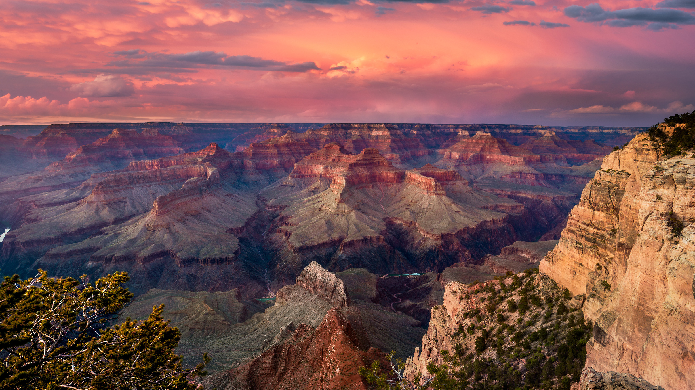
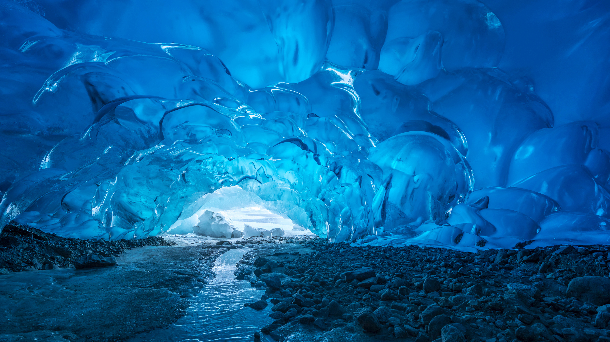

<div align="center">

# 🖼️ Bing-Wallpapers

[](https://github.com)
[](https://opensource.org/licenses/MIT)

> 自动抓取并归档高清必应每日壁纸

</div>

<!-- gallery_start -->
## 🌟 最新壁纸

| 日期 | 图片名称 | 图片 |
|:---:|:---:|:---:|
| 2026-02-27 | 薄冰上的生活 |  |
| 2026-02-26 | 一幅壮丽的景象 |  |
| 2026-02-25 | 冰由内而外透出光芒 |  |

<!-- gallery_end -->

## 📂 存储结构

```text
Bing-Wallpapers/
├── Basics/          原始 UHD 超高清壁纸
│   └── YYYY/MM/     按年月归档 (YYYYMMDD_标题.jpg)
└── Add Exif/        注入版权与描述 EXIF 信息的版本
    └── YYYY/MM/
```

## ⚙️ 更新机制

由 GitHub Actions 每日定时自动抓取并推送，无需人工干预。

## 📌 声明

所有壁纸版权归提供商和摄影师所有，仅供学习与个人收藏使用。
