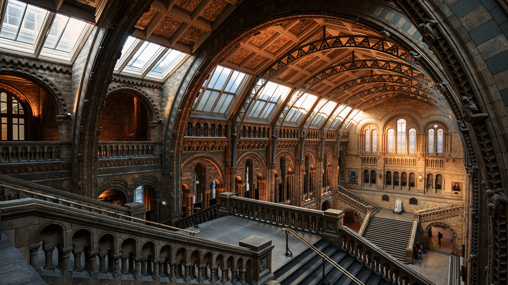

<div align="center">

# 🖼️ Bing-Wallpapers

[](https://github.com)
[](https://opensource.org/licenses/MIT)

> 自动抓取并归档高清必应每日壁纸

</div>

<!-- gallery_start -->
## 🌟 最新壁纸

|2026-05-18 大厅里的希望|2026-05-17 静谧之巅喧嚣之景|2026-05-16 跌到谷底这里可不是|
| :--------------------------------------------: | :--------------------------------------------: | :--------------------------------------------: |
|  |  |  |
|**[UHD 原图下载](https://raw.githubusercontent.com/xiaopowanyi/Bing-Wallpapers/refs/heads/main/Basics/2026/05/20260518_大厅里的希望.jpg)**|**[UHD 原图下载](https://raw.githubusercontent.com/xiaopowanyi/Bing-Wallpapers/refs/heads/main/Basics/2026/05/20260517_静谧之巅喧嚣之景.jpg)**|**[UHD 原图下载](https://raw.githubusercontent.com/xiaopowanyi/Bing-Wallpapers/refs/heads/main/Basics/2026/05/20260516_跌到谷底这里可不是.jpg)**|

<!-- gallery_end -->

## 📂 存储结构

```text
Bing-Wallpapers/
├── Basics/          原始 UHD 超高清壁纸
│   └── YYYY/MM/     按年月归档 (YYYYMMDD_标题.jpg)
└── Add Exif/        注入版权与描述 EXIF 信息的版本
    └── YYYY/MM/
```

## ⚙️ 更新机制

由 GitHub Actions 每日定时自动抓取并推送，无需人工干预。

## 📌 声明

所有壁纸版权归提供商和摄影师所有，仅供学习与个人收藏使用。
